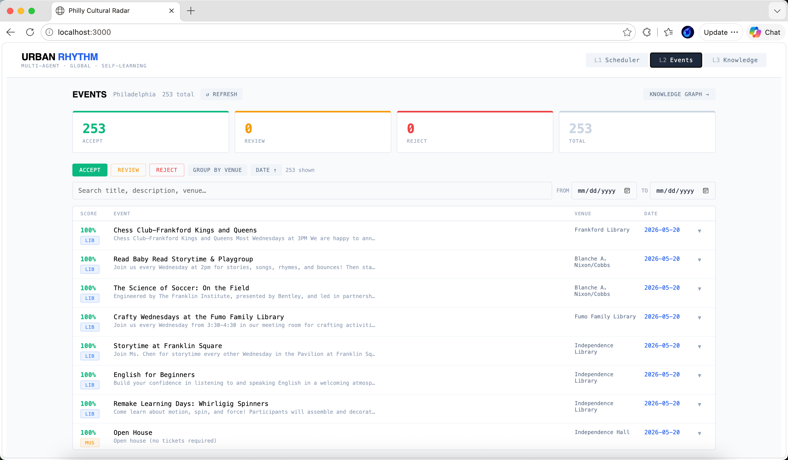

# UrbanRhythm

A multi-agent AI pipeline that autonomously discovers, scrapes, judges, and semantically indexes cultural events across any US city — real-time streamed to a 3-layer React dashboard.

---

## Live Demo — Philadelphia, PA

253 accepted events extracted from 40+ cultural venues across Philadelphia in a single pipeline run. Events are scored, judged, and grouped by venue.



**What the pipeline did:**
- Discovered 80+ venues via OpenStreetMap Overpass API
- Scraped each venue website with a ReAct agent (iCal → JSON-LD → LLM extraction)
- Judged every event with a hybrid rule-based + Claude Sonnet scorer
- Indexed results into a searchable dashboard with venue grouping and date filtering

---

## Documents

### [Design Decisions](DESIGN)
How I thought through the architecture — each major decision with rationale and trade-offs. Start here.

### [Agents & Tools Reference](AGENTS_AND_TOOLS)
Complete reference for every agent, tool, model, and external API in the pipeline.

### [Technical Architecture](TECHNICAL)
System diagram, API endpoints, and full data flow end-to-end.

---

## Pipeline at a Glance

```
city_resolver → venue_discovery → [Send × N] scrape_venue → judge → knowledge_graph
                                         ↑
                              LangGraph parallel fan-out
```

**Stack**: LangGraph · FastAPI · GPT-4o-mini · Claude 3.5 Sonnet · OpenRouter · SQLite · React · Vite

**Source**: [github.com/lluluciano0505/UrbanRhythm](https://github.com/lluluciano0505/UrbanRhythm)
